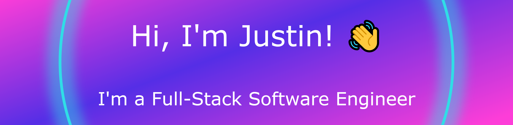

<h3>About me:</h3>

After completing my degree in music technology 🎶 at the University of South Wales in 2019 I wanted to continue on the path of learning about tech, So in 2020 i started a part time class in computing 🖥️ which helped me gather a basic understand of programming concepts and gave me my first experience in software development. 

In 2022 i chose to further my tech knowledge 📖 by applying for a course through the Princes Trust in partnership with Nology. This partnership aims to get more people in to the tech sector by providing an intense 12 week bootcamp style course ✍️ which teaches all the skills needed to become a junior full-stack developer.

In February 2023 I completed the training programme. As stressfull as it was, it has been an extremely rewarding experience and one which will propel me 💨 into a tech role in no time.

<h3>Languages and Tools:</h3>

 
 
 
 
 
 
 
 
 
 
 
 

<h3>Cool Stats:</h3>

<!--
**JustinDotMorris/justindotmorris** is a ✨ _special_ ✨ repository because its `README.md` (this file) appears on your GitHub profile.

Here are some ideas to get you started:

- 🔭 I’m currently working on ...
- 🌱 I’m currently learning ...
- 👯 I’m looking to collaborate on ...
- 🤔 I’m looking for help with ...
- 💬 Ask me about ...
- 📫 How to reach me: ...
- 😄 Pronouns: ...
- ⚡ Fun fact: ...
-->
